---
output:
  xaringan::moon_reader:
    seal: false
    css: xaringan-themer.css
    nature:
      slideNumberFormat: "%current%"
      highlightStyle: github
      highlightLines: true
      ratio: 16:9
      countIncrementalSlides: true
---

class: inverse, center, middle
background-image: url(figures/danielle1.png)
background-size: cover

# A remote glimpse into the useR! 2021 conference


.large[Anna Quaglieri | R-Ladies Melbourne Meetup | 3 Aug 2021]

.left[.footnote[Art by Danielle Navarro, *Silhouette in Teal* (2021) Random walk, flametree L-system]]


```{r setup, include=FALSE}
options(htmltools.dir.version = FALSE)
knitr::opts_chunk$set(
  fig.width=9, fig.height=3.5, fig.retina=3,
  out.width = "100%",
  cache = FALSE,
  echo = TRUE,
  message = FALSE, 
  warning = FALSE,
  hiline = TRUE
)
```

```{r xaringan-themer, include=FALSE, warning=FALSE}
# devtools::install_github("gadenbuie/xaringanExtra")

library(xaringanExtra)
library(xaringan)
library(xaringanthemer)
library(fontawesome)

style_duo_accent(
  primary_color = "#7b8e1f",
  secondary_color = "#fcab01",
  inverse_header_color = "#290502", 
  link_color = "darkmagenta",
  code_highlight_color = "#add8e6", 
  footnote_color = "black", 
  footnote_position_bottom = "40px", 
  footnote_font_size = "0.7em"
)
```

---
name: intro

## A bit about me

--

Got my Bachelor and Master in Statistics between the Universities of Bologna, Glasgow and Melbourne

.center[]

---

### A bit of research

- Master research in Population Genetics at the WEHI + worked for 1.5 years as RA
- PhD in Cancer Genomics at the WEHI

--

### A bit outside of research

- After my PhD, I Decided to try a different path outside of research 
- Worked as Data Science consultant for 1.5 years at the AI consultancy Eliiza

---
class: center

## Since two months

I'm a Bioinformatics Data Scientist at the Melbourne based startup [Mass Dynamics](https://www.massdynamics.com/)

--

.pull-left[

> Mass Dynamics is on a mission to free humanity and society from the burden of disease by helping more life scientists transform proteomics data to knowledge - better, faster and easier.


]

--

.pull-right[

]


---
name: whatme

## What I actually do every day 

--

🏡💻 **Work in a fun team**: Work with a fun interdisciplinary team of scientists, developers, marketing savvy.

--

📙 **Learn**: Learn the intricacies and amazingness of mass spectrometry (= most used technique to quantify proteins in a sample) & what life scientists need to make the best use of their experiment.

--

👩‍💻 **Code in R**: Assemble workflows in R to analyse mass spectrometry data.

--

👐 **Open Science**: Learn and strive for reproducibility and openness in what we produce.

--

🥜 **In a nutshell**: Study & Learn, think, build solutions (mainly in R packages)‚ debug, debug, debug, repeat. 

---
class: centre, inverse
background-image: url(figures/will.png)
background-size: cover


# useR! 2021

.left[.footnote[Art by Will Chase, USA, *Terrazzo, confetti* (2021) Voronoi Tessellation, Poisson disc sampling]]


---
class: center

# useR! is one of my favorite conferences!

.pull-left[
#### R-Ladies dinner useR! 2018 

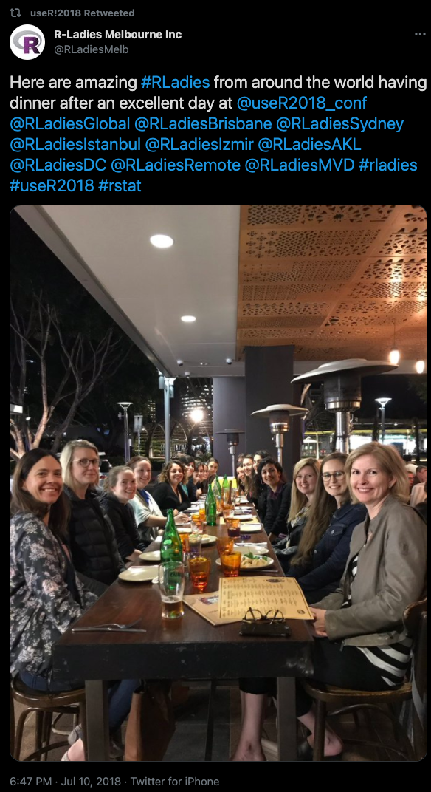]

.pull-right[
#### R-Ladies online cathcup 2021 

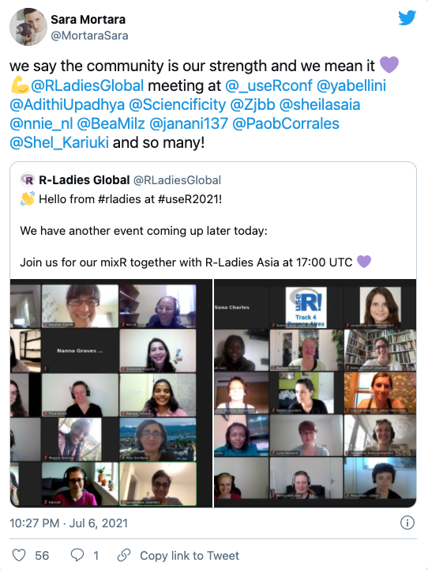
]

---

# Disclaimer

- My highlights also corresponds to talks presented in our timezone

--

- All talks and workshops will be made available online very very soon! I'll keep you posted 

.center[]

---

# Topics that I will cover

- [Teaching and Learning R & Statistics](#teaching) 
- [Data visualisation](#viz)
- [Data Validation and Package Testing](#valid)
- [Surprise!](#surprise)
- [Keynote: **Heidi Seibold** on *Research Software Engineers (RSE) & Academia*](#heidi)
- [R in Production and Package dependencies](#prodr) 
- [aRt gallery](#art)

---
name: teaching
class: top

## Teaching and learning statistics

.centre[]

.footnote[
Artwork by [@allison_horst](https://www.allisonhorst.com/)]

---

## Developing a datasets based R package to teach environmental data science

#### Author and speaker: Allison Horst 

- 🔗[Introduced the `{lterdatasampler}`](https://lter.github.io/lterdatasampler/): LTER Data Sampler 📦 (LTER = Long Term Ecological Research program (LTER) Network)
- LTER goal is education and training

--

#### Lesson learnt from this talk

- A great way to learn how to build an R 📦 is to create a data-package (package that only includes data)

--

- I don't have super complex, cool new functions... I cannot write an R 📦

--

- Free gift! Data packages are an enormously useful tool for teaching purposes (how many times have you used the [`{iris}` dataset [1]](https://en.wikipedia.org/wiki/Iris_flower_data_set)??!!) 

.footnote[R. A. Fisher (1936). "The use of multiple measurements in taxonomic problems". Annals of Eugenics. 7 (2): 179–188. doi:10.1111/j.1469-1809.1936.tb02137.x. hdl:2440/15227]

---

## 🐧 `{palmerpenguins}` is the new `{iris}` 🌷

.pull-left[
#### Authors: Allison Horst, Alison Hill, Kristen Gorman

The 🔗[`{palmerpenguins}` 📦](https://allisonhorst.github.io/palmerpenguins/) provides a great dataset for data exploration & visualization, as an alternative to iris. 

```{r eval=FALSE}
install.packages("palmerpenguins")
library(palmerpenguins)
```


.center[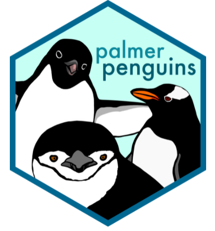]


]

--

.pull-right[

Meet the penguins! 

.center[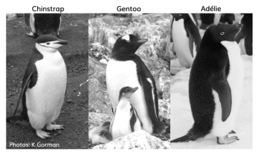]


.center[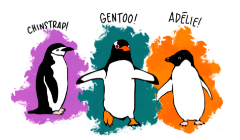]

]

.footnote[
Artwork by [@allison_horst](https://www.allisonhorst.com/)]

---

```{r eval=TRUE}
library(palmerpenguins)
library(dplyr)
library(DT)

penguins %>% head()
```


---
class: middle, center

```{r echo=FALSE}
library(microshades)
library(ggplot2)

hex_values <-c(microshades_palette("micro_green", 1, lightest = FALSE), 
               microshades_palette("micro_blue", 1, lightest = FALSE), 
               microshades_palette("micro_purple", 1, lightest = FALSE))

p=ggplot(penguins, aes(x = bill_length_mm, 
                     y = flipper_length_mm, 
                     colour = species)) + 
  geom_point() +
  scale_color_manual(values = hex_values, 
                     na.translate = FALSE) +
  theme_bw()
```


```{r echo=FALSE}
p
```


---

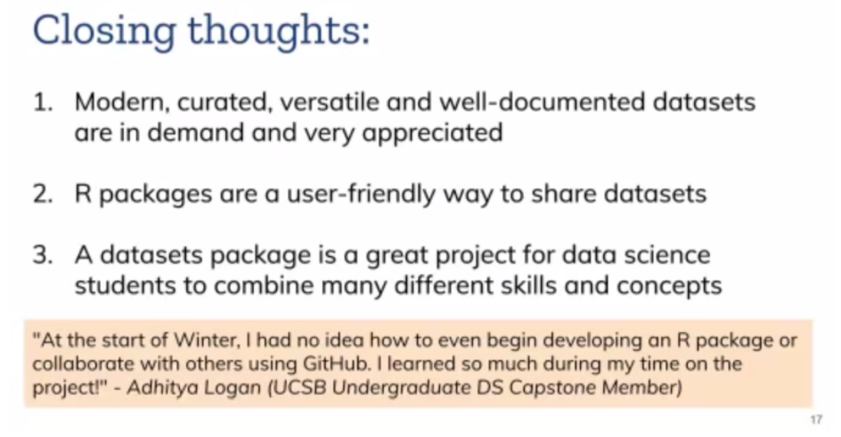


---

## Creating R packages: resources that I found super useful!

Get started with 🔗[R Packages](https://r-pkgs.org/) by Hadley Wickham. Easy to read and very comprehensive.  

What you need to get started:

1. Code (one function is enough) AND/OR data (it doesn't have to be large!)

--

2. An R project in a new folder `/path/to/myPackage`

--

3. Run the code `usethis::create_package("/path/to/myPackage")` (more info https://r-pkgs.org/workflows101.html). 
This will create the metadata and other files that you need to package the package up!

--

4. You're setup!


---

## To recapitulate: Setup your R package in a few lines!

.pull-left[
```{r eval=FALSE}
usethis::create_package("/path/to/myPackage")
```

.center[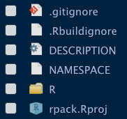]

]

--

.pull-right[
```{r eval=FALSE}
data_fake <- data.frame(First = seq(1:200), 
                        Second = rep("A", 200))
usethis::use_data(data_fake) #<<
```

.center[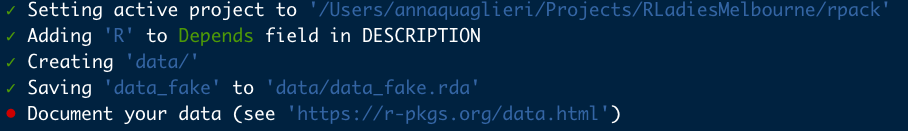]


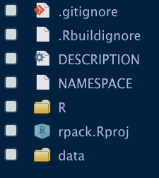
]

.footnote[
[R Packages](https://r-pkgs.org/) by Hadley Wickham
]


---

## `{fusen}` 📦: Create a package from Rmd

--

#### Speaker and author: Sébastien Rochette

> If you know how to create a Rmarkdown file, then you know how to build a package.

#### 🔗[Introduction to `{fusen}` ](https://thinkr-open.github.io/fusen/)

--

**Philosophy** You don't need to move around functions and files to create a package, you only need your Rmd with functions, documentation, tests, examples. 

--

.pull-left[
```{r eval=FALSE, echo=TRUE}
install.packages("fusen")
library(fusen)
```

.center[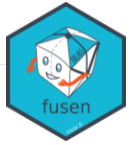]


]

.pull-right[.center[]]

---

## `Rmd` first approach to write an R 📦

.pull-left[

1. Write your `Rmd` using some prefix to name code chunks, e.g. `description`, `function`, `tests`, `examples`

2. These prefixes will tell `{fusen}` how to create your package
]

--

.pull-right[

**Inflate!**

.center[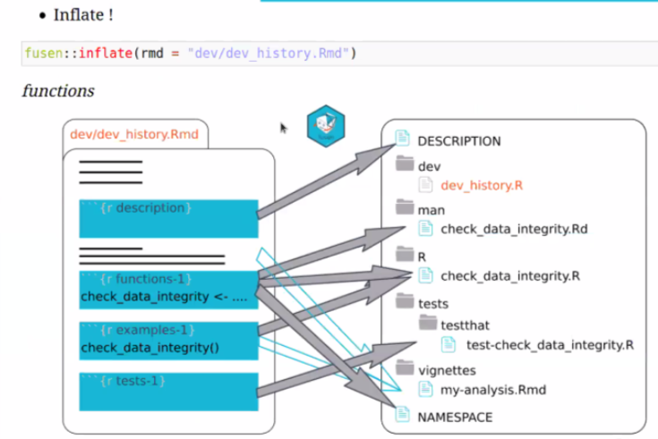]

]


---

## Building and maintaining OpenIntro using the R ecosystem

#### Speaker: Cetinkaya-Rundel, Mine

- 🔗[OpenIntro website](https://www.openintro.org/) has loads of resources to teach and learn statistics (for free!)
- 🔗[OpenIntro R 📦](https://github.com/OpenIntroStat/openintro) has supplemental functions and data for OpenIntro resources.

.pull-left[
.center[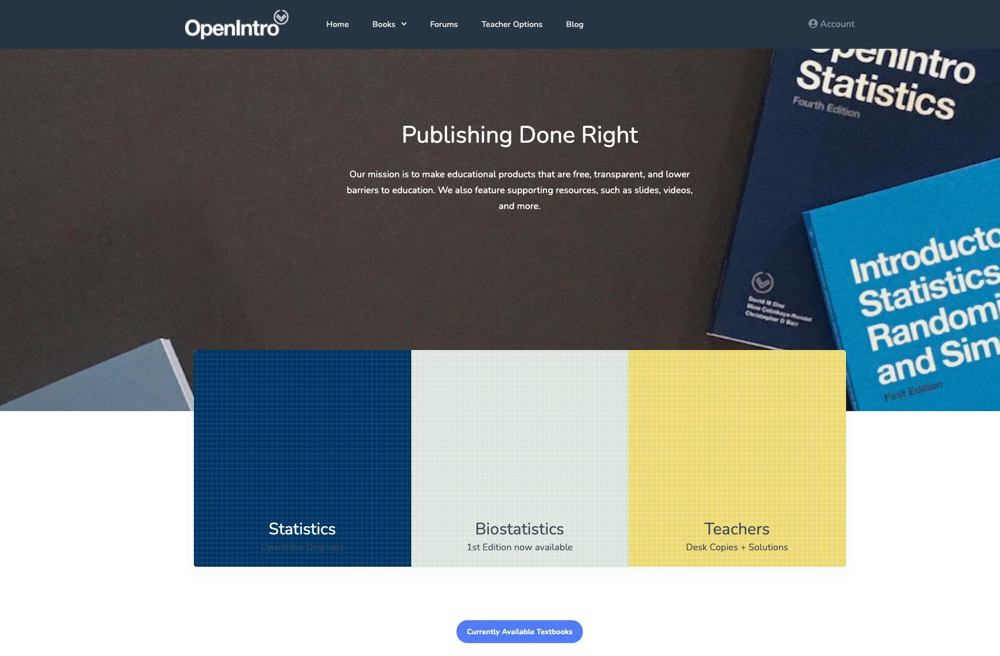]
]

.pull-right[
.center[]
]


---

## Another lesson to build a data-centric-package!

.center[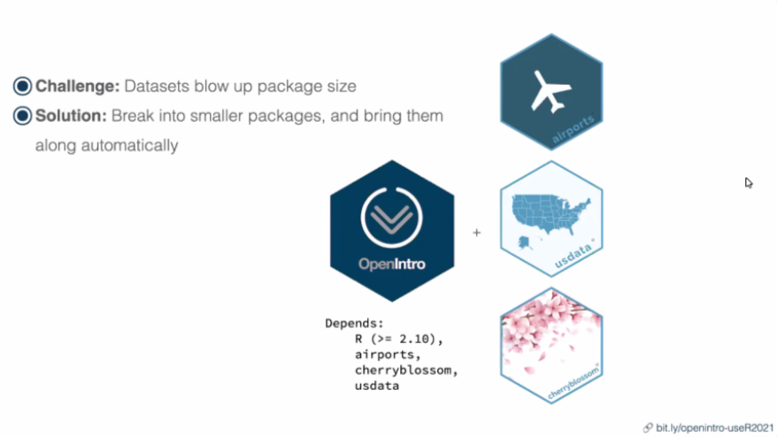]

`{OpenIntro}` depends on 3 other data packages. See package 🔗[DESCRIPTION](https://github.com/OpenIntroStat/openintro/blob/master/DESCRIPTION)


---

## Teaching and learning Bayesian statistics with `{bayesrules}` 📦

#### Speaker: Mine Dogucu (🔗[GitHub repo](https://github.com/bayes-rules/bayesrules) and 🔗[Talk slides](https://mdogucu.github.io/user-2021/#1) )

.pull-left[
- The `{bayesrules}` package contains tools for teaching and learning tools for teaching (and learning) Bayesian statistics 

- The package accompanies the open-access 🔗[Bayes Rules! An Introduction to Bayesian Modeling with R](https://www.bayesrulesbook.com/)
]


.pull-right[
.center[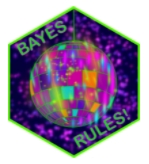]

]


---
class: top, middle
background-image: url(figures/iema.png)
name: viz

## Data Visualisation

.left[.footnote[Art by Ijeamaka Anyene, USA, *Sunset* (2021)]]


---

## Keynote: Expanding the vocabulary of R graphics

#### Speaker: Paul Murrel author of `{grDevices}` 📦 

.pull-left[
- A graphics engine containing functions for both base and grid graphics.
- The `{grid}`📦  is low-level system for plotting within R (`{ggplot2}`📦 is based on this)
- Grid graphics and R’s base graphics are two separate systems. 
- Usually worth using grid graphics when you need to create a very unusual plot that cannot be created using `ggplot2`
]

.pull-right[
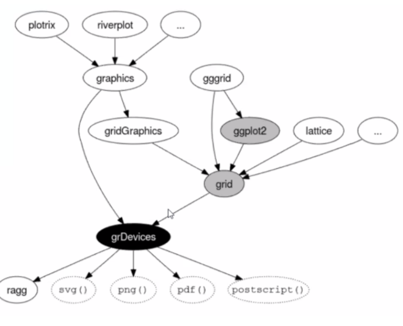
]

---

## 🔗[Paul Murrel's New Features in the R Graphics Engine](https://developer.r-project.org/Blog/public/2020/07/15/new-features-in-the-r-graphics-engine/)

### Gradient and radial fill

```{r}
library(grid)
```


.pull-left[
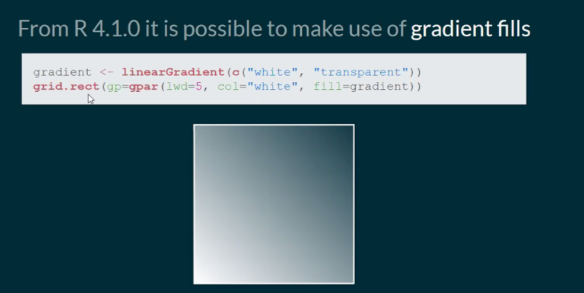

]


.pull-right[
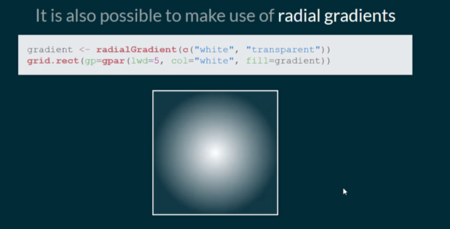

]


---

### Pattern fills

```{r}
library(grid)
```

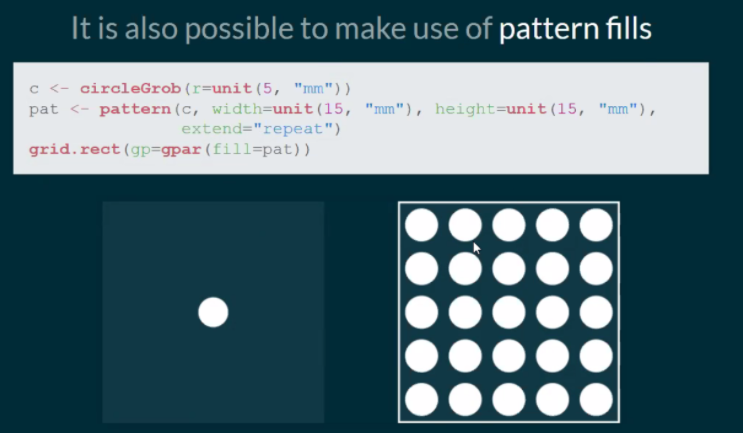


---
class: center

# Going beyond statistical plots

#### 🔗[Paul Murrel's talk: *Going beyond statistical plots*](https://www.stat.auckland.ac.nz/~paul/Talks/ANZSC2021/index.html)

You can build illustrator like viz!

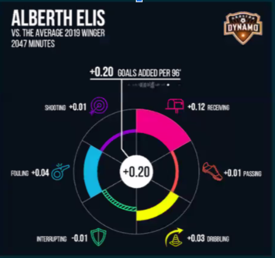


---

## The `{virgo}` 📦

#### Speaker: [Stuart Lee](https://github.com/sa-lee) 
#### Authors: Stuart Lee and [Earo Wang](https://earo.me/) 

🔗[Introduction to `virgo`](https://vegawidget.github.io/virgo/)

--

- Allows to easily build interactive graphics for exploratory data analysis

--

- Allows cross interactivity between plots without having to build a Shiny app

--

- `virgo` plots also works within Shiny

---

## `{virgo}` in action!

.pull-left[

```{r virgo-setup}
library(virgo)
library(palmerpenguins)
```

```{r virgo-sel}
selection <- select_interval()
```

```{r virgo-left}
p <- penguins %>% 
  vega() %>% 
  mark_circle(
    enc(
      x = bill_length_mm, 
      y = bill_depth_mm, 
      color = encode_if(selection, species, "black")
    )
  )
```
]

.pull-right[
```{r virgo-p}
p
```
]

.footnote[🔗[Introduction to `virgo`](https://vegawidget.github.io/virgo/)]


---

.pull-left[
```{r virgo-right}
p_right <- penguins %>% 
  vega(enc(x = body_mass_g)) %>% 
  mark_histogram(bin = list(maxbins = 20)) %>% 
  mark_histogram(color = "purple", bin = list(maxbins = 20),
    selection = selection) %>% 
  mark_rule(enc(x = vg_mean(body_mass_g)), color = "red", size = 4,
    selection = selection)
```
]


.pull-right[
```{r}
p_right
```
]

.footnote[🔗[Introduction to `virgo`](https://vegawidget.github.io/virgo/)]

---

### Concatenate interactivity!

```{r}
hconcat(p, p_right)
```

.footnote[🔗[Introduction to `virgo`](https://vegawidget.github.io/virgo/)]


---

## Do you see what I see? The `{microshades}` 📦

.pull-left[
#### Speaker and Author: [Lisa Karstens, PhD](https://www.ohsu.edu/people/lisa-a-karstens-phd)

🔗[Introduction to `microshades`](https://github.com/KarstensLab/microshades)


Provide custom color shading palettes that improves:
- **accessibility** for Color Vision Deficient (CVD) people
- **data organization** 

```{r eval=FALSE}
remotes::install_github("KarstensLab/microshades")
```
]

--

.pull-right[
Two crafted colour palettes:
- `microshades_cvd_palettes`
- `microshades_palettes`

Total of 30 available colours per palette.


]

---

## `{microshades}` in action!

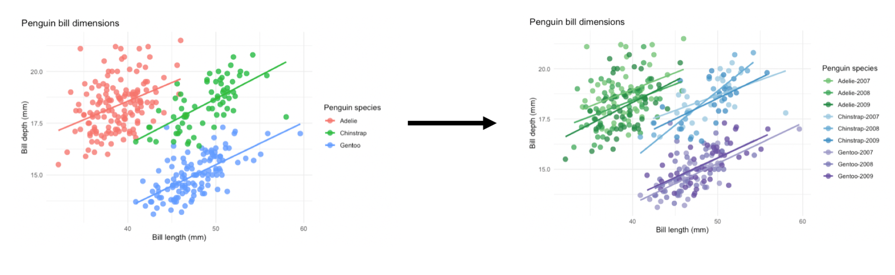

.footnote[🐧 `{palmerpenguins}` with `{microshades}` example code: https://karstenslab.github.io/microshades/articles/non-microbiome_data.html ]


---
class: inverse, centre, middle
name: valid
background-image: url(figures/antonio.png)
background-size: cover

## Data validation and Unit testing

.left[.footnote[Art by Antonio Sánchez, Spain, *Jellyfish* (2018), Sines and cosines]]


---

## `{autotest}` 📦: Automatic testing for R packages 

#### Speaker and author: [Mark Padgham](https://mpadge.github.io/), Software Research Scientst at [`rOpenSci`](https://ropensci.org/)

🔗[Introduction to `{autotest}` `r fa(name = "github")`](https://github.com/ropensci-review-tools/autotest)


```{r eval=FALSE}
install.packages("autotest")
```

--

- `{autotest}` goes into the examples of your R 📦 functions and *mutates* (aka changes) the inputs parameters to function calls.

--

- This allows to check for robustness of the package to several inputs

---


## `{autotest}` in actions

```{r eval=FALSE}
library(autotest)
y <- autotest_package(package = "stats", functions = "var", test = TRUE)
```

.pull-left[
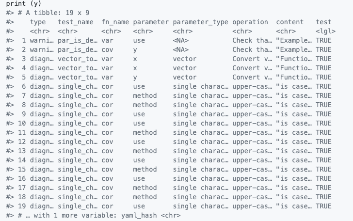
]

.pull-right[
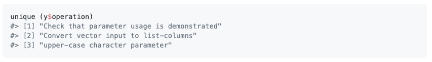
]


---

## A fresh look at unit testing with `{tinytest}` 📦

.pull-left[
#### Speaker and author: Mark van der Loo

🔗[Introduction to `{tinytest}` `r fa(name = "github")`](https://github.com/markvanderloo/tinytest)

```{r eval=FALSE}
install.packages("tinytest")
```

- The purpose is to facilitate the development of unit testing of R 📦

- It provides you with better stats and ideas where the errors actually occurred
]

--

.pull-right[
.center[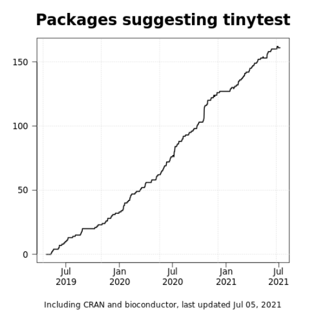]
]

.footnote[
[1] M van der Loo (2017). tinytest: R package version 1.2.4. https://cran.r-project.org/package=tinytest

[2] MPJ van der Loo (2020) A method for deriving information from running R code. R-Journal (Accepted) https://arxiv.org/abs/2002.07472
]


---

## `{tinytest}` in action!

🔗[Overview of `{tinytest}` functionalities](https://github.com/markvanderloo/tinytest/blob/master/pkg/README.md)

```{r}
library(tinytest)

addOne <- function(x) x + 1
subOne <- function(x) x - 2
```

--

```{r}
# this test should pass
tinytest::expect_equal(addOne(1), 2 )
```

--

```{r}
# this test will fail
tinytest::expect_equal(subOne(2), 1 ) 
```


---

## Tutorial: Data validation with the `{validate}` 📦

#### Author: Mark van der Loo 

The purpose is to provide easy to use tools to check that you're data is valid! 

- 🔗[Easy data validation for the masses `r fa(name = "github")`](https://github.com/data-cleaning/validate)
- 🔗[The Data Validation Cookbook](https://data-cleaning.github.io/validate/)


.footnote[
[1] MPJ van der Loo and E de Jonge (2020). Data Validation Infrastructure for R. Journal of Statistical Software, Accepted for publication. https://arxiv.org/abs/1912.09759

[2] MPJ van der Loo (2020) The Data Validation Cookbook version 1.0.1. https://data-cleaning.github.io/validate

]


---

## {validate} in action!

```{r}
library(palmerpenguins)
head(penguins)
```


```{r}
table(penguins$island, penguins$species)
```


---

#### Create a `validator` with rules

--

- Separate multiple validations by a comma

--

- The example shows multivariate validation including completeness validation (`is_complete`) and conditional validations.

--

```{r}
library(validate)

rules <- validator(flipper_length_mm > 0, 
                   
           is_complete(bill_depth_mm, flipper_length_mm, bill_depth_mm), 
           
           if(island %in% "Biscoe") species %in% c("Adelie"))
```

--

```{r}
confront(penguins, rules) %>% summary()
```


---
class: center, middle, inverse
name: surprise
background-image: url(figures/will-chase2.png)
background-size: cover

# Teasing your appetite for next month R-Ladies Melbourne event

# Spoiler Alert!

.left[.footnote[Art by Will Chase, USA, *Triangle disintegration* (2019), Curl noise, trigonometry]]


---


## Here is the anomalous-down! 

--

.pull-left[

#### Author and speaker [Dr Sevvandi Kandanaarachchi](https://www.rmit.edu.au/contact/staff-contacts/academic-staff/k/kandanaarachchi-dr-sevvandi)

R packages that Sevvandi developed to find anomalies in high-dimensional data:

- 🔗[Introduction to dobin](https://cran.r-project.org/web/packages/dobin/vignettes/dobin.html)
- 🔗[Introduction to lookout](https://sevvandi.github.io/lookout/)

.center[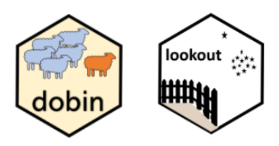]


]

--

.pull-right[
.center[]
]


---
class: centre, inverse
name: heidi
background-image: url(figures/iema3.png)
background-size: cover

.left[.footnote[Art by Ijeamaka Anyene, USA, *Clouds* (2021)]]


# Keynote: Heidi Seibold
# Research Software Engineers (RSE) & Academia


---

## What is an RSE?

https://researchsoftware.org/

.center[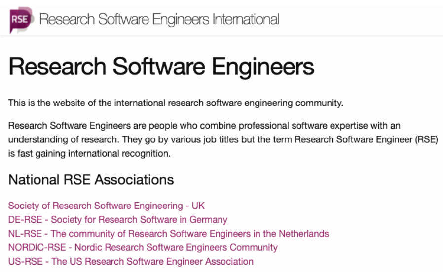]

---

## Heidi’s path

.pull-left[
.center[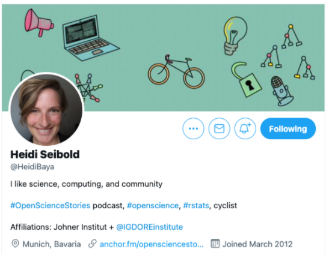]

]

.pull-right[
.center[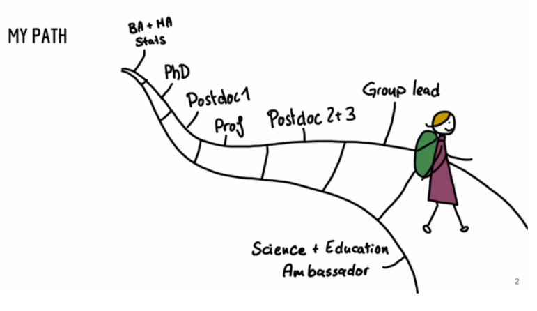]

]


---
background-image: url(figures/open-stories.png)

### [Heidi's Podcast](https://anchor.fm/opensciencestories)

---

### What does an RSE do?

- An RSE builds software for research 

--

- Generally writes code and teaches about software to researchers 

--

- Consult researcher with any kind of software problem

--


.center[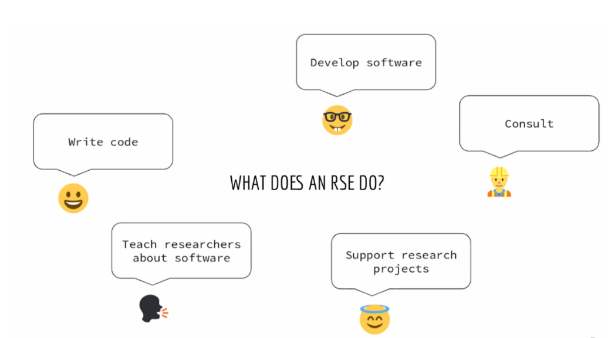]


---

## Tools for Open and Reproducible Science

It's a bit too much to expect that the researcher would do all of those things + their research!

The RSE comes to help!

.center[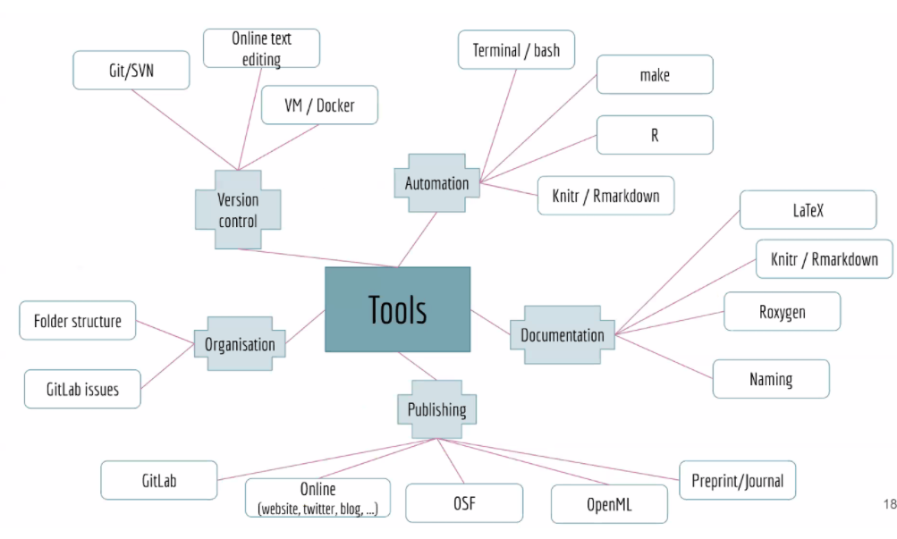]

---

## If you think this does for you...

You can become part of the community!

.center[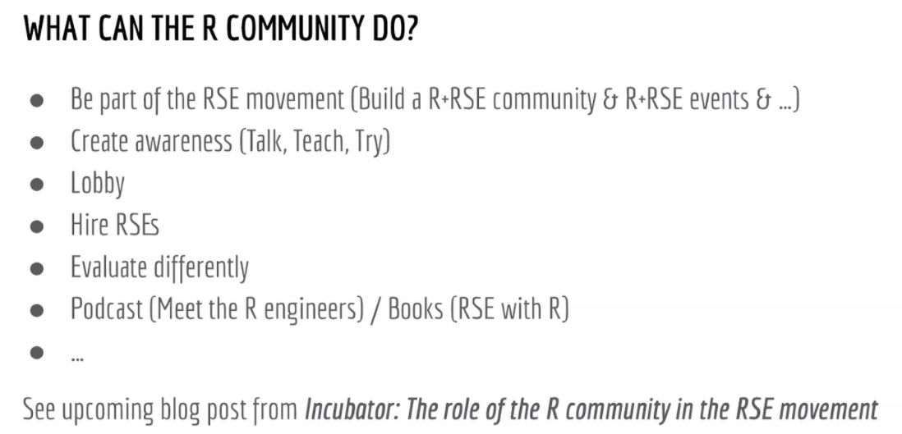]


---
class: center, middle, inverse
name: prodr
background-image: url(figures/will-chase3.png)
background-size: cover

.left[.footnote[Art by Will Chase, USA, *Bubble strings* (2021), Flow fields, circle packing, perlin noise]]


# R in production

---

## What does "R in production" mean?

Example from my experience. 
- 👩‍💻 I'm a data scientist at Mass Dynamics and I build R 📦  to analyse mass spectrometry data

--

- But, Mass Dynamics wants to make the functionalities of the R packages easily available also to 👩‍🔬  life scientist, reducing the barrier of having to learn to code  

--

- The solution: the life scientist can interact with an easy user interface (UI, aka *frontend*) which runs my R 📦  in the background (aka *backend*) 

--

- Every time a scientist interacts with the UI, the R 📦  is run -> This is R in production 🎉! 

---

## How do we do that? 

There is a bit of engineering setup and jargon to digest & there are various of way of accomplishing this task!

--

Tricky aspects:

--

- A lot of aspects are around the engineering setup (which is not my expertise!)

--

- However, from my side I need to make sure that:
  - all dependencies needed by my R packages are available in production
  
--

  - all packages are put into production with a defined version to allow *reproducibility*
  
--

  - Managing dependencies can be really tricky!
    - How do you know all that you need, when a package will depends on another package, and anothe rpackage will depend on another one etc...

---

## What are package dependencies?

--

You find them in the `DESCRIPTION` file of a package, disguising under:

- `Depends`, `Imports`, `SystemRequirements` (dependencies external from R)

- Example from the `{sf}` 📦 https://github.com/r-spatial/sf/blob/master/DESCRIPTION

---

## How to find them all?

How do you determine all the dependencies needed to reproduce an R package/project environment to make it reporodcible, open, shareable, safe for production?

My summary of suggestions after discussing with speakers at useR! 2021:

- [`{renv}` 📦](https://rstudio.github.io/renv/articles/renv.html):
  - is the emerging method to manage package/project dependencies in R. 
  - Calling `renv::snapshot()` saves the state of the project library to the lockfile (called `renv.lock`)
  - Really useful but for a given project it could give you more than you need (may affect speed).

--

- Hard code your dependency, start minimal and grow:
  - It's really useful to grow your dependency list little by little. 
  - Start with package `imports` (looking at the `DESCRIPTION` file) and then look for system dependencies 

---

## Ways to find out system dependencies of a 📦

- [r-hub/sysreqs 📦](https://github.com/r-hub/sysreqs)  provides a database with API to quickly find out which packages or other software needs to be available to build and use R packages.

  - Usage: `sysreqs::sysreq_commands(desc = "path/to/a/DESCRIPTION/file")` runs all the commands to install the necessary runtime system dependencies.
  
--

- [rstudio/r-system-requirements](https://github.com/rstudio/r-system-requirements): RStudio independently maintained catalogue of dependencies, used to power the [RStudio package manager](https://packagemanager.rstudio.com/client/#/repos/1/packages/A3) 

--

- [{maketools} 📦](https://cran.r-project.org/web/packages/maketools/vignettes/sysdeps.html) To get runtime dependencies (only for Linux)

```{r eval=TRUE}
maketools::package_sysdeps("stringi")
```


---

## These awesome suggestions from:

Suggestions from speakers at useR! 2021:
- Peter Solymos speaker for *Data science serverless-style with R and [OpenFaas](https://www.openfaas.com/)*
- [Max Held](https://www.maxheld.de/) speaker for: *Bridging the Unproductive Valley: Building Data Products Strictly Without Magic*

Other resources: 
- Interesting blog: [Determining system dependencies for R projects](https://mdneuzerling.com/post/determining-system-dependencies-for-r-projects/)
- R-blogger post about useR! 2021 [Integrating R into production talks](https://www.r-bloggers.com/2021/07/user2021-integrating-r-into-production/) 

---

## Productionising ML models developed in R

#### Author: [Surya Avala](https://github.com/suryaavala), ML Engineer at [@whispr](https://github.com/whispir) ([Talk slides](https://github.com/suryaavala/prodr/blob/main/prodr.pdf))

(Not from useR!) But I found it really useful! 

Phylosphy: Wrapping up everything with Docker 🐳 and using [`{plumber}` 📦](https://www.rplumber.io/) to generate and API for R.

.center[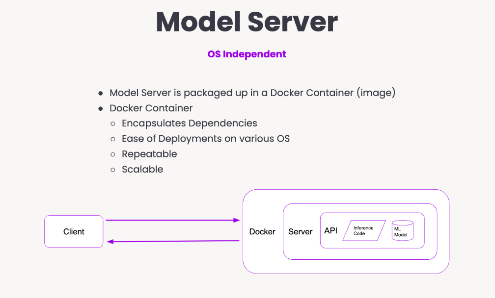]

---
background-image: url(figures/thoams.png)
background-size: cover
class: center, middle
name: art

# [aRt gallery](https://user_2021.gitlab.io/user2021_art_gallery/#46)

.left[.footnote[*Yonder 1831*, 2021 by Thomas Lin Pedersen (Denmark). Flow lines, nearest neighbour, texture blending]]

---

## Thanks to

- useR! organisers and speakers!
- Mass Dynamics for letting me take part to the conference
- [`Meet Xaringan: Making slides in R Markdown`](https://arm.rbind.io/slides/xaringan.html#1) by Alison Hill, learn how to make beautiful slides using `{xaringan}`.
- These slides were created using the `{xaringan}` 📦 by Yihui Xie (2021). xaringan: Presentation Ninja. R package version 0.22. https://CRAN.R-project.org/package=xaringan 
- Shazia Ruybal [Xaringan's slides from her previous R-Ladies Melbourne talk](https://github.com/shaziaruybal) for examples

---

## Glossary of R packages mentioned

.pull-left[
#### Teaching and Learning R & Statistics
- [`{lterdatasampler}`](https://lter.github.io/lterdatasampler/)
- [`{palmerpenguins}`](https://allisonhorst.github.io/palmerpenguins/)
- [`{usethis}`](https://usethis.r-lib.org/)
- [`{fusen}`](https://thinkr-open.github.io/fusen/)
- [`{OpenIntro}`](https://github.com/OpenIntroStat/openintro)
- [`{bayesrules}`](https://github.com/bayes-rules/bayesrules)

#### Data visualisation
- [`{grid}`](https://developer.r-project.org/Blog/public/2020/07/15/new-features-in-the-r-graphics-engine/)
- [`{virgo}`](https://vegawidget.github.io/virgo/)
- [`{microshades}`](https://github.com/KarstensLab/microshades)
]

.pull-right[
#### Data Validation and Package Testing
- [`{autotest}`](https://github.com/ropensci-review-tools/autotest)
- [`{tinytest}`](https://github.com/markvanderloo/tinytest)
- [`{validate}`](https://github.com/data-cleaning/validate)

#### Next month surprise!
- [`{dobin}`](https://github.com/sevvandi/dobin)
- [`{lookout}`](https://github.com/sevvandi/lookout)

#### Manage package dependencies
- [`{renv}`](https://rstudio.github.io/renv/articles/renv.html)
- [`{sysreqs}`](https://github.com/r-hub/sysreqs)
- [`{maktools}`](https://cran.r-project.org/web/packages/maketools/vignettes/sysdeps.html)
]


---
class: top, middle
background-image: url(figures/iema4.png)

.footnote[Art by Ijeamaka Anyene, USA, *Arcs IV* (2020)]


# Any question?

You can fine me at:

- [`r fa(name = "twitter")` @annaquagli](https://twitter.com/annaquagli)
- [`r fa(name = "github")` @annaquaglieri16](https://github.com/annaquaglieri16) 